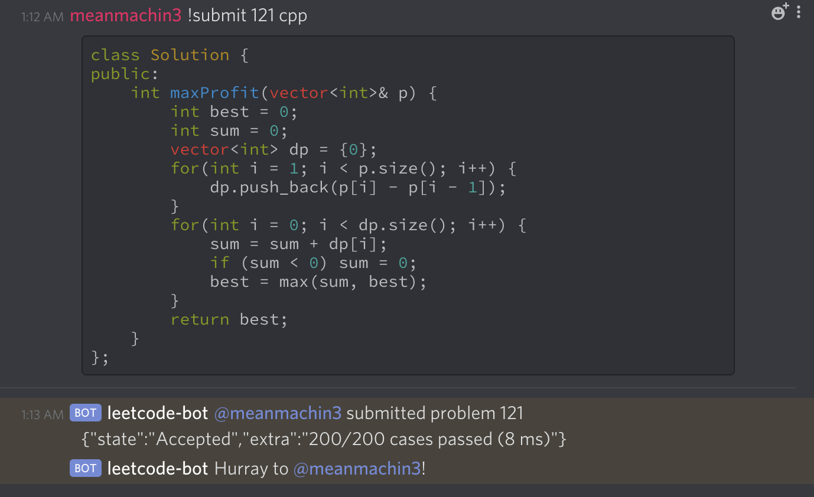

<p align="center">
    
</p>

Discord bot that sends leetcode questions every Monday to Friday to practise your algorithmic skills

## Running application locally

1. Clone this repositry `https://github.com/meanmachin3/leetcode-bot.git`

2. Create your bot token over [here](https://discordapp.com/developers/applications/me)

3. create `.env` file

4. `mv env.sample .env`

5. Paste your env settings

6. node index.js

## Deploy Bot to Heroku

[](https://heroku.com/deploy?template=https://github.com/meanmachin3/leetcode-bot.git)

After deploying, add the following environment variables

```
GUILD: your_server_name
```

```
CHANNEL: your_channel_name_to_post
```

```
BOT_TOKEN: bot_token
```

```
LEETCODE_LOGIN: leetcode_user_name
```

```
LEETCODE_PASS: leetcode_pass_word
```

Save changes.

## Server configuration

1. Go to Resources
2. Scale down your web worker
3. Scale up your worker node

## Usage

1. `!help`: To see list of commands available
2. `!submit`: To submit code directly from server to leetcode

## Screenshots


